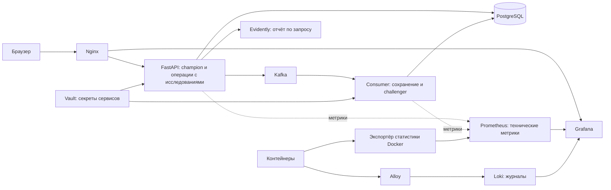

# Diabetes Predict

В этом проекте я реализую полный цикл работы ML-приложения: подготовку данных,
обучение и версионирование моделей, прогноз через веб-интерфейс, сбор фактических
исходов, оценку качества и контролируемое обновление контейнеров через CI/CD.
Приложение учебное и не предназначено для постановки медицинского диагноза.

## Возможности

- Прогноз по восьми показателям исследования с вероятностью положительного класса.
- История исследований с фильтрами по пациенту, периоду, модели и наличию исхода.
- Исправление показателей с атомарным пересчётом моделей и журналом изменений.
- Основная модель **champion** и фоновые модели **challenger**.
- Снимки данных с обратной связью для повторного обучения.
- Метрики качества, пропуски и drift по выбранной временной шкале.
- Технические графики и журналы приложения в Grafana.
- Пользовательские роли, отзыв сессий, защищённое хранение секретов и резервные копии.

## Архитектура и выбор инструментов



| Компонент | Для чего я его использую |
|---|---|
| Python 3.11, FastAPI, Pydantic | API, проверка входных данных и автоматически формируемая OpenAPI-документация |
| HTML, CSS, JavaScript, Nginx | Интерфейс без отдельного Node-сервера; Nginx раздаёт файлы, проксирует API и проверяет доступ к Grafana |
| pandas, NumPy, scikit-learn | Подготовка табличных данных, единый pipeline предобработки и классификации, обучение и контрольные расчёты |
| PostgreSQL, SQLAlchemy | Связанные исследования, прогнозы, исходы, версии и аудит; транзакции и ограничения защищают согласованность данных |
| Kafka | Передача прогноза на сохранение и фоновую обработку; повторная доставка не должна создавать дубликаты |
| DVC, WebDAV Яндекс Диска | Версионирование артефактов моделей вне Git и получение именно того выпуска, который соответствует коду |
| Evidently | Числовые метрики качества, пропуски и сравнение распределений непосредственно по данным PostgreSQL |
| Prometheus | Технические временные ряды: запросы, ошибки, задержки, CPU и память |
| Alloy, Loki | Сбор и поиск структурированных журналов без превращения каждого сообщения в метрику |
| Grafana | Общие технические дашборды по Prometheus и Loki; ML-отчёт встроен непосредственно в приложение |
| Vault, KeePassXC | Vault выдаёт сервисам секреты; KeePassXC хранит bootstrap-данные для ручной разблокировки и обслуживания |
| Docker Compose, GitHub Actions, Docker Hub | Изолированный запуск, проверка и доставка контейнеров; выпуск закрепляется по digest образов |
| pytest, Ruff, Trivy | Проверка поведения, стиля и известных уязвимостей перед публикацией |

Точные Python-версии закреплены в `requirements.txt` и `requirements-runtime.txt`.
Образы и контрольные суммы находятся в Dockerfile, `docker-compose.yml` и
`infrastructure/`. Итоговый пакет выпуска содержит точный состав образов,
commit, номер CI и описание моделей.

## Требования и установка

Для локальной установки нужны Git, Python 3.11, Docker Desktop в режиме
Linux-контейнеров, Docker Compose V2, KeePassXC CLI и доступ к хранилищу DVC.
GNU Make предоставляет сокращённые команды; соответствующие Python-команды
можно запускать напрямую. CI использует Linux; постоянная локальная выкладка
настроена на Windows self-hosted runner.

Для полной сборки нужно предусмотреть запас диска Docker: только кэш пересборки
Grafana занимает около 9 ГБ, сверх образов и данных. Сборочные инструменты и кэши
не входят в рабочие контейнеры. CI повторно использует образы мониторинга и
инфраструктуры по контрольным суммам входных файлов, но сканирует их при каждом
выпуске. Первая полная сборка заметно дольше; её задание ограничено 180 минутами.
На одноразовом Linux runner перед сборкой удаляются неиспользуемые Android/.NET/Haskell
SDK; между сборками служебных образов очищается промежуточный Docker-кэш.
Локальная установка и тома приложения этой очисткой не затрагиваются.

Из корня клонированного репозитория в PowerShell:

```powershell
py -3.11 -m venv .venv
.\.venv\Scripts\python.exe -m pip install -r requirements.txt
.\.venv\Scripts\python.exe -m scripts.configure_dvc_yandex
.\.venv\Scripts\python.exe -m dvc pull models
.\.venv\Scripts\python.exe -m src.register_release models/current.json
```

`configure_dvc_yandex` запрашивает логин и пароль приложения WebDAV скрытым вводом.
Доступ сохраняется в `.dvc/config.local`, исключённом из Git. Последняя команда
проверяет манифест, происхождение и контрольные суммы моделей без записи в БД.
Не следует открывать или загружать произвольные файлы joblib: это доверенные
исполняемые артефакты, поступающие из контролируемого выпуска.

Для нового разработческого стенда из исходников:

```powershell
.\.venv\Scripts\python.exe -m scripts.start_stack --local-build --keepass-db "C:/путь/vault-keys.kdbx"
```

Это отдельный режим первоначальной сборки. Его нельзя использовать для замены
уже установленного выпуска: обновлением управляет CD. Базовый Compose содержит
совместимую исходную инфраструктуру; проверяемые инфраструктурные образы и перенос
существующих томов обслуживаются отдельно через `infrastructure/` и команды миграции.

## Ежедневная работа

После запуска Docker Desktop:

```powershell
make start
```

При запросе нужно указать базу KeePassXC и ввести мастер-пароль. Команда
разблокирует Vault, возобновляет существующие контейнеры и включает зарегистрированный
Windows runner. Локальные исходники не пересобираются. Без Make:

```powershell
.\.venv\Scripts\python.exe -m scripts.deploy_release --resume
```

| Адрес | Назначение |
|---|---|
| `http://localhost:8080` | Веб-приложение |
| `http://localhost:8080/api/docs` | Swagger UI |
| `http://localhost:8080/api/health` | Проверка API |
| `http://localhost:8080/api/db/health` | Проверка подключения API к БД |
| `http://localhost:8080/grafana/` | Grafana после входа администратором приложения |

Обычный пользователь создаёт прогнозы. История, исправления, обратная связь,
снимки и мониторинг доступны администратору. Публичной регистрации нет.
Администратор Docker создаёт учётную запись отдельной командой:

```powershell
.\.venv\Scripts\python.exe -m scripts.create_user administrator --role admin
```

Пароль вводится дважды скрытым вводом; существующий пользователь не перезаписывается.
Команда использует отдельный процесс обслуживания БД, а не расширенные права API.
Сессия действует восемь часов; отключение пользователя или смена его пароля отзывает
доступ при следующем запросе.

## Данные и жизненный цикл прогноза

Исследование определяется кодом пациента и датой. Код имеет формат `ABC123`.
Используются восемь признаков: число беременностей, глюкоза, давление, толщина
кожной складки, инсулин, ИМТ, наследственный показатель диабета и возраст.

1. API проверяет поля и выбирает текущую champion из реестра БД.
2. Если прогноз этой версии для такого исследования уже сохранён и показатели
   совпадают, возвращается сохранённый результат.
3. Иначе pipeline рассчитывает класс и вероятность. API фиксирует исследование
   и публикует результат в Kafka. Подтверждение Kafka означает принятие сообщения,
   но не завершение записи consumer в PostgreSQL.
4. Consumer сохраняет результат и рассчитывает challenger. Уникальные ограничения
   и блокировки защищают от дубликатов при повторной доставке.
5. Ошибки фоновой модели попадают в `shadow_retries`. Повторы выполняются автоматически
   с увеличением паузы; при недоступной БД сообщение Kafka не подтверждается.

Другие показатели для существующего кода и даты дают `409`: изменение выполняется
через редактирование исследования. Перед сохранением проверяется, что исходная
карточка не была изменена другим запросом. Все затронутые модели пересчитываются
атомарно. Аудит сохраняет прежние значения, а пользовательский отчёт использует
актуальные показатели, прогнозы и исходы. Даты существующих прогнозов не сдвигаются.

Основные таблицы: `studies`, `predictions`, `feedback`, `study_edits`,
`feedback_history`, `datasets`, `dataset_rows`, `training_runs`, `model_versions`,
`model_role_history`, `shadow_retries`, `users`, `user_sessions`.
Источник схемы — `src/db/models.py`; `db/01_schema.sql` генерируется из него,
`db/02_audit.sql` содержит ограничения и триггеры аудита.

## Обучение и версии моделей

Исходный набор — `data/raw/diabetes.csv`. Настройки путей и разбиения находятся
в `config.ini`, алгоритмы и пространство поиска — в `training.json`.
Разбиение по умолчанию: train 70%, validation 15%, test 15%, seed 57.

```powershell
make train
.\.venv\Scripts\python.exe -m dvc metrics show
.\.venv\Scripts\python.exe -m src.register_release models/current.json
```

Я использую логистическую регрессию как простой базовый классификатор и дерево
решений для сравнения с нелинейной моделью. Импутация и масштабирование входят
в pipeline и обучаются только на train. Нули глюкозы, давления, кожной складки,
инсулина и ИМТ трактуются как пропуски; ноль беременностей допустим.
Для логистической регрессии применяется масштабирование, для дерева оно не требуется.

GridSearchCV подбирает гиперпараметры на train с пятью фолдами. Победитель выбирается
по validation F1; test оценивается после выбора. Манифест выпуска сохраняет параметры,
метрики, разбиение и контрольные суммы. Обучение создаёт новую версию и обновляет
`models/current.json`, не меняя сохранённые модели предыдущих выпусков.

Снимок обратной связи содержит обучающий CSV и отдельный `lineage.json` с происхождением
строк. При обучении на снимке пациенты разделяются между выборками и фолдами,
чтобы один пациент не попадал одновременно в обучение и проверку.

```powershell
.\.venv\Scripts\python.exe -m src.train --feedback-snapshot "data/feedback/идентификатор/data.csv"
```

Снимок создаётся администратором через интерфейс. Артефакты нового выпуска нужно
добавить и отправить в DVC до пуша кода, который на них ссылается.
Регистрация новой версии не заменяет действующую champion автоматически;
смена роли выполняется администратором и попадает в аудит.

## Мониторинг моделей

Раздел **«Метрики моделей»** обращается к `GET /api/monitoring/model-report`.
Evidently работает как библиотека внутри API: расчёт запускается по запросу,
отдельного сервера и хранилища отчётов нет. Ответ содержит агрегаты, а не строки пациентов.

- По умолчанию выбираются champion, вся доступная история и месячные интервалы.
- Временная шкала — время запроса прогноза в UTC либо дата исследования.
- День, неделя и месяц — отдельные календарные интервалы, без накопления.
  Крайние интервалы обрезаются выбранным диапазоном.
- Качество модели считается только по исследованиям с исходом; дата добавления
  исхода не определяет точку на графике. Поздний исход пересчитывает прежний интервал.
- Качество данных и drift используют все подходящие прогнозы по той же временной шкале.
- Исследования, входившие в датасет выбранной версии, исключаются из мониторинговой
  выборки. Эталон drift состоит только из строк train этой версии.

Отчёт показывает Accuracy, Recall, Precision, F1, специфичность, NPV, ROC AUC,
Log loss, матрицу ошибок, число прогнозов и исходов, долю положительного класса,
пропуски и PSI. Класс берётся из сохранённого прогноза, вероятность — для ROC AUC
и Log loss. Неопределённые значения отображаются пропусками, а не нулями.

PSI рассчитывается отдельно для каждого признака; сигнал — `PSI ≥ 0.25`.
Нужно минимум 100 непустых значений признака в текущей и эталонной выборках.
При недостатке данных drift не рассчитывается; само качество модели остаётся доступным.
Маленькая выборка помечается предупреждением: несколько исходов могут заметно
изменить метрики. Сигнал drift требует изучения данных, а не автоматического переобучения.

Красная подсветка метрик означает результат хуже базового ориентира, а не нарушение
универсальной медицинской нормы. Если `p` — доля положительных исходов в интервале,
ориентиры: Accuracy `max(p,1-p)`; Recall/Precision/F1 `p`; специфичность/NPV `1-p`;
ROC AUC `0.5`; Log loss `-p·ln(p)-(1-p)·ln(1-p)`. Для Log loss проверяется превышение,
для ROC AUC — значение не выше 0.5, для остальных — снижение ниже ориентира.
Сравнение выполняется при наличии обоих классов; отсутствие подсветки само по себе
не подтверждает приемлемого качества.

Нажатие на точку открывает подробности. В интерфейсе конец периода включён,
в API и CSV используется `end_exclusive` — следующий день, который уже не входит
в интервал. Доступен экспорт агрегатов в CSV. Лимиты одного запроса: 50 000 прогнозов,
400 дневных/недельных или 1200 месячных точек, SQL до 5 секунд; между этапами
проверяется бюджет расчёта 45 секунд. Одновременно выполняется один ML-отчёт на процесс API.

## Работа приложения: Grafana, Prometheus и журналы

Раздел **«Работа приложения»** открывает сохранённые дашборды Grafana.
Кнопка с её логотипом ведёт к выбранному дашборду. Пользовательские изменения
сохраняются в томе `grafana_data`. Установлены источники Prometheus и Loki;
плагин Infinity не используется.

Технические показатели собираются каждые 30 секунд: доступность API, число запросов,
ошибки, p95 времени ответа, время inference, состояние consumer, CPU и память.
Prometheus хранит техническую историю до 30 дней или до достижения лимита 1 ГБ.
Это ограничение не относится к ML-отчёту и исследованиям PostgreSQL.
Отдельный встроенный веб-интерфейс Prometheus не включается в сборку: для графиков
используется Grafana, а сбор метрик и HTTP API Prometheus сохраняются.

API и consumer пишут JSONL, Alloy передаёт журналы в Loki. В журналах нет показателей
пациента, паролей, cookies или полных URL с параметрами. Корреляция выполняется
по `request_id`. Ротация ограничивает размер локальных журналов.
Для статистики Docker используется отдельный прокси с разрешёнными операциями чтения;
API, Grafana и сканер не получают Docker socket.

## Безопасность и резервные копии

Сессии проверяются по БД; cookie имеет HttpOnly и SameSite=Strict, изменяющие запросы
защищены CSRF. Nginx и API ограничивают частоту и размер запросов.
Доступ к Grafana проверяет API при каждом обращении через Nginx.
API и consumer имеют разные ограниченные роли PostgreSQL; обслуживание схемы
и создание пользователей выполняется отдельным административным процессом.

Контейнеры приложения работают без root, с файловой системой только для чтения,
ограничениями ресурсов и отдельными томами для записываемых данных. Модели подключаются
только для чтения и не включаются в новые образы приложения. Vault AppRole и TLS
применяются при подготовке проверенного стенда и миграции постоянной установки.

```powershell
make backup
make backup-encrypt BACKUP_SOURCE="backups/копия.dump" BACKUP_TARGET="backups/копия.enc"
```

Перед обновлением автоматически создаётся PostgreSQL dump. Проверка оглавления
подтверждает формат архива, но не заменяет проверку восстановления. Внешнее хранение
копий и его расписание настраиваются отдельно. Расшифровка создаёт новый файл
и не восстанавливает рабочую БД автоматически. Тома данных и резервные копии
нельзя удалять как временные файлы.

Trivy проверяет образы до публикации и повторно по расписанию. Исправляемые
HIGH/CRITICAL блокируют выпуск. Исходные находки сохраняются; ограниченная оценка
неприменимости привязана к конкретному бинарнику, CVE, версии и сроку пересмотра.
Группы образов используют общий кэш базы Trivy с проверкой обновлений, чтобы
не скачивать одну базу несколько раз за запуск CI.
Основания: [Vault](infrastructure/vault/REVIEW.md),
[Grafana и её плагины](monitoring/grafana/SECURITY.md).

## CI/CD и обновление

1. Push в `develop`/`main` и pull request в `main` запускают CI.
2. CI проверяет Ruff, схему БД, Python-тесты, JavaScript и артефакты DVC.
3. Собираются API и frontend. Неизменившиеся образы Grafana, Prometheus, Loki,
   Alloy и инфраструктуры загружаются по digest; изменившиеся пересобираются.
   Все образы проверяются Trivy до публикации.
4. После успешных проверок push публикует образы и пакет выпуска. Pull request
   проверяется без публикации выпуска.
5. Успешный CI для `main` запускает CD. На одноразовом Linux-стенде проверяются
   интеграция, роли БД, Vault, API, Kafka и мониторинг.
6. Windows runner проверяет актуальность commit и совместимость установленной
   инфраструктуры, создаёт копию БД, обновляет схему и контейнеры готовыми образами.
   Локальная сборка при выкладке не выполняется.

В GitHub нужны секреты `DVC_YANDEX_USER`, `DVC_YANDEX_PASSWORD`,
`DOCKERHUB_USERNAME`, `DOCKERHUB_TOKEN`. Runner регистрируется командой
`make setup-runner` с метками `self-hosted`, `Windows`, `X64`, `devops-production`.
`DEVOPS_DEPLOY_HOME` указывает на постоянное состояние выпуска; `DEVOPS_PYTHON`
может явно задать Python виртуального окружения. Docker и runner должны быть доступны
во время задания. Для эксплуатации самого приложения runner не обязателен.

**Первый переход со старой инфраструктуры требует отдельной миграции.** Обычный CD
не заменяет автоматически PostgreSQL, Kafka и Vault при несовпадении образов.
После получения проверенного пакета используются:

```powershell
make security-plan RELEASE="путь/к/пакету"
make security-migrate RELEASE="путь/к/пакету" KEEPASS_DB="C:/путь/vault-keys.kdbx"
```

Миграция проверяет принадлежность томов, готовит копии и данные восстановления.
При незавершённом переносе обычная выкладка блокируется; восстановление выполняется
командой `make security-restore` с доступом к KeePassXC. После подтверждения миграции
CD можно повторить. Инструменты не должны запускаться параллельно с другой выкладкой.

Текущая схема CD предназначена для локальной Windows-установки. Развёртывание
на Ubuntu/VPS, публичный HTTPS, Secure-cookie и внешний backup-store — отдельная
конфигурация эксплуатации, а не результат `make start`.

## Разработка и проверки

```powershell
.\.venv\Scripts\python.exe -m pip install ruff==0.16.6
.\.venv\Scripts\python.exe -m ruff check src scripts tests notebooks infrastructure
.\.venv\Scripts\python.exe -m ruff format --check src scripts tests notebooks infrastructure
.\.venv\Scripts\python.exe -m scripts.generate_schema --check
make test
```

Для проверки JavaScript нужен Node.js 22: `node --check frontend/app.js`
и такая же проверка файлов `frontend/js/*.js`. Интеграционные тесты запускаются
только на одноразовом стенде через `scripts.start_stack --ci --check`; имя проекта,
порты и тома должны отличаться от постоянной установки. Полный пример запуска
проверенного пакета находится в `.github/workflows/cd.yml`.

`make preview` публикует локальные файлы интерфейса на `http://localhost:8081`.
Этот preview использует API установленного приложения: новые маршруты требуют
соответствующей версии backend. Обновление страницы — Ctrl+F5.

| Каталог | Содержимое |
|---|---|
| `src/` | API, модели данных, inference, Kafka, мониторинг и обучение |
| `frontend/` | Интерфейс, локальные шрифты и конфигурация Nginx |
| `db/` | Генерируемая SQL-схема и аудит |
| `data/`, `models/`, `reports/` | Датасеты, DVC-артефакты и результаты обучения |
| `notebooks/` | Исследование данных и сравнение алгоритмов |
| `monitoring/` | Prometheus, Grafana, Loki, Alloy и прокси статистики Docker |
| `infrastructure/` | Проверяемые инфраструктурные образы и доказательства применимости CVE |
| `scripts/` | Запуск, доставка моделей, обслуживание, миграция и резервное копирование |
| `tests/`, `.github/` | Автоматические проверки и CI/CD |

`make` выводит доступные команды. `.local-history/`, `.venv/`, `backups/`, журналы
и локальные секреты исключены из Git. В `.local-history/` также хранится рабочее
состояние runner и выпуска — это не каталог, который можно целиком очищать.

## Документация инструментов

[FastAPI](https://fastapi.tiangolo.com/), [scikit-learn](https://scikit-learn.org/stable/),
[DVC](https://dvc.org/doc), [Evidently](https://docs.evidentlyai.com/),
[Grafana](https://grafana.com/docs/grafana/latest/),
[Prometheus](https://prometheus.io/docs/introduction/overview/),
[Vault](https://developer.hashicorp.com/vault/docs),
[Docker Compose](https://docs.docker.com/compose/),
[GitHub Actions](https://docs.github.com/en/actions).
