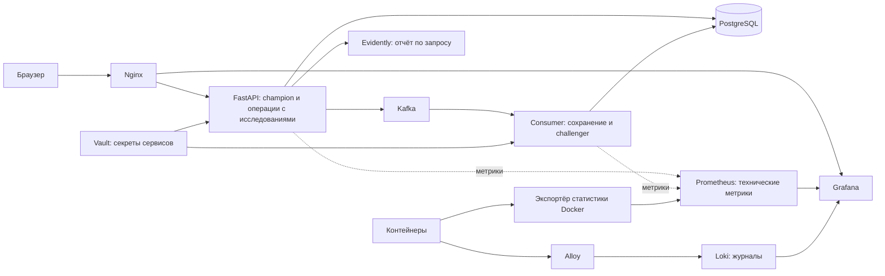

# Diabetes Predict

В этом проекте реализован полный цикл работы ML-приложения: подготовка данных,
обучение и версионирование моделей, прогноз через веб-интерфейс, сбор фактических
исходов, оценка качества и контролируемое обновление контейнеров через CI/CD.


## Возможности

- Прогноз по восьми показателям исследования с вероятностью положительного класса.
- История исследований (журнал) с фильтрами по пациенту, периоду, модели и наличию исхода.
- Исправление показателей с атомарным пересчётом моделей и журналом изменений.
- Основная модель **champion** и фоновая модель **challenger**.
- Снимки данных с обратной связью для повторного обучения.
- Метрики качества, пропуски и drift по выбранной временной шкале.
- Технические графики и журналы приложения в Grafana.
- Пользовательские роли, отзыв сессий, защищённое хранение секретов и резервные копии.

## Архитектура и выбор инструментов



| Компонент | Выполняемые задачи |
|---|---|
| Python 3.11, FastAPI, Pydantic | API, проверка входных данных и автоматически формируемая OpenAPI-документация |
| HTML, CSS, JavaScript, Nginx | Интерфейс без отдельного Node-сервера; Nginx - раздача файлов, проксирование API и проверка доступа к Grafana |
| Pandas, NumPy, scikit-learn | Подготовка табличных данных, единый pipeline предобработки и классификации, обучение и контрольные расчёты |
| PostgreSQL, SQLAlchemy | Связанные исследования, прогнозы, исходы, версии и аудит; транзакции и ограничения, которые обеспечивают согласованность данных |
| Kafka | Передача прогноза на сохранение и фоновую обработку; отсутствие дубликатов при повторной отправке |
| DVC, WebDAV Яндекс Диска | Версионирование артефактов моделей вне Git и получение именно того выпуска, который соответствует коду |
| Evidently | Числовые метрики качества, пропуски и сравнение распределений непосредственно по данным PostgreSQL |
| Prometheus | Технические временные ряды: запросы, ошибки, задержки, CPU и память |
| Alloy, Loki | Сбор и поиск структурированных журналов |
| Grafana | Общие технические дашборды по Prometheus и Loki |
| Vault, KeePassXC | Vault - выдача сервисам секреты; KeePassXC - хранение bootstrap-данных для ручной разблокировки и обслуживания |
| Docker Compose, GitHub Actions, Docker Hub | Изолированный запуск, проверка и доставка контейнеров |
| Pytest, Ruff, Trivy | Проверка поведения, стиля и известных уязвимостей перед публикацией |


## Требования и установка

Для локальной установки нужны Git, Python 3.11, Docker Desktop в режиме
Linux-контейнеров, Docker Compose V2, KeePassXC CLI и доступ к хранилищу DVC.
GNU Make предоставляет сокращённые команды; соответствующие Python-команды
можно запускать напрямую. CI и CD используют временные Linux-машины GitHub;
CD передаёт проверенный выпуск на подготовленный Ubuntu-сервер по SSH.

Сборочные инструменты и кэши не входят в рабочие контейнеры. Обычный CI использует уже опубликованные образы
мониторинга и инфраструктуры. Их сборка и повторная проверка перед публикацией
выполняются вручную через workflow `Infrastructure` с ограничением 180 минут.
В этом отдельном задании на одноразовом Linux runner перед сборкой удаляются
неиспользуемые Android/.NET/Haskell SDK; между сборками служебных образов очищается Docker-кэш.
Локальная установка и тома приложения этой очисткой не затрагиваются.

Docker хранит образы отдельно от кэша сборки. Образы нужны для запуска контейнеров,
а кэш позволяет повторно использовать результаты компиляции и установки зависимостей.
Удаление кэша не удаляет данные приложения, но следующая сборка может занять больше
времени и повторно скачать зависимости. Перед очисткой нужно проверить `docker system df`
и `docker ps -a`: остановленные контейнеры и предыдущие выпуски тоже могут быть нужны.
На VPS доставляются готовые образы и пакет выпуска; локальный кэш сборки туда не копируется.


## Работа приложения
После запуска Docker Desktop:

```powershell
make start
```

При запросе нужно указать базу KeePassXC и ввести мастер-пароль. Команда
разблокирует Vault, возобновляет существующие контейнеры и включает зарегистрированный
Windows runner. Локальные исходники не пересобираются. Без Make:

```powershell
.\.venv\Scripts\python.exe -m scripts.deploy_release --resume
```

| Адрес | Назначение |
|---|---|
| `http://localhost:8080` | Веб-приложение |
| `http://localhost:8080/api/docs` | Swagger UI |
| `http://localhost:8080/api/health` | Проверка API |
| `http://localhost:8080/api/db/health` | Проверка подключения API к БД |
| `http://localhost:8080/grafana/` | Grafana после входа администратором приложения |

Обычный пользователь создаёт прогнозы. История, исправления, обратная связь,
снимки и мониторинг доступны администратору. Публичной регистрации нет.
Администратор Docker создаёт учётную запись отдельной командой:

```powershell
.\.venv\Scripts\python.exe -m scripts.create_user administrator --role admin
```

Пароль вводится дважды скрытым вводом; существующий пользователь не перезаписывается.
Команда использует отдельный процесс обслуживания БД, а не расширенные права API.
Сессия действует восемь часов; отключение пользователя или смена его пароля отзывает
доступ при следующем запросе.

## Данные и жизненный цикл прогноза

Исследование определяется кодом пациента и датой. Код имеет формат `ABC123`.
Используются восемь признаков: число беременностей, глюкоза, давление, толщина
кожной складки, инсулин, ИМТ, наследственный показатель диабета и возраст.

1. API проверяет поля и выбирает текущую champion из реестра БД.
2. Если прогноз этой версии для такого исследования уже сохранён и показатели
   совпадают, возвращается сохранённый результат.
3. Иначе pipeline рассчитывает класс и вероятность. API фиксирует исследование
   и публикует результат в Kafka. Подтверждение Kafka означает принятие сообщения,
   но не завершение записи consumer в PostgreSQL.
4. Consumer сохраняет результат и рассчитывает challenger. Уникальные ограничения
   и блокировки защищают от дубликатов при повторной доставке.
5. Ошибки фоновой модели попадают в `shadow_retries`. Повторы выполняются автоматически
   с увеличением паузы; при недоступной БД сообщение Kafka не подтверждается.

Другие показатели для существующего кода и даты дают `409`: изменение выполняется
через редактирование исследования. Перед сохранением проверяется, что исходная
карточка не была изменена другим запросом. Все затронутые модели пересчитываются
атомарно. Аудит сохраняет прежние значения, а пользовательский отчёт использует
актуальные показатели, прогнозы и исходы. Даты существующих прогнозов не сдвигаются.

Основные таблицы: `studies`, `predictions`, `feedback`, `study_edits`,
`feedback_history`, `datasets`, `dataset_rows`, `training_runs`, `model_versions`,
`model_role_history`, `shadow_retries`, `users`, `user_sessions`.
Источник схемы — `src/db/models.py`; `db/01_schema.sql` генерируется из него,
`db/02_audit.sql` содержит ограничения и триггеры аудита.

## Обучение и версии моделей

Исходный набор — `data/raw/diabetes.csv`. Настройки путей и разбиения находятся
в `config.ini`, алгоритмы и пространство поиска — в `training.json`.
Разбиение по умолчанию: train 70%, validation 15%, test 15%, seed 57.

```powershell
make train
.\.venv\Scripts\python.exe -m dvc metrics show
.\.venv\Scripts\python.exe -m src.register_release models/current.json
```

Применена логистическая регрессия как простой базовый классификатор и дерево
решений для сравнения с нелинейной моделью. Импутация и масштабирование входят
в pipeline и обучаются только на train. Нули глюкозы, давления, кожной складки,
инсулина и ИМТ трактуются как пропуски; ноль беременностей допустим.
Для логистической регрессии применяется масштабирование, для дерева оно не требуется.

GridSearchCV подбирает гиперпараметры на train с пятью фолдами. Победитель выбирается
по validation F1; test оценивается после выбора. Манифест выпуска сохраняет параметры,
метрики, разбиение и контрольные суммы. Обучение создаёт новую версию и обновляет
`models/current.json`, не меняя сохранённые модели предыдущих выпусков.

Снимок обратной связи содержит обучающий CSV и отдельный `lineage.json` с происхождением
строк. При обучении на снимке пациенты разделяются между выборками и фолдами,
чтобы один пациент не попадал одновременно в обучение и проверку.

```powershell
.\.venv\Scripts\python.exe -m src.train --feedback-snapshot "data/feedback/идентификатор/data.csv"
```

Снимок создаётся администратором через интерфейс. Артефакты нового выпуска нужно
добавить и отправить в DVC до пуша кода, который на них ссылается.
Регистрация новой версии не заменяет действующую champion автоматически;
смена роли выполняется администратором и попадает в аудит.

## Мониторинг моделей

Раздел **«Метрики моделей»** обращается к `GET /api/monitoring/model-report`.
Evidently работает как библиотека внутри API: расчёт запускается по запросу,
отдельного сервера и хранилища отчётов нет. Ответ содержит агрегаты, а не строки пациентов.

- По умолчанию выбираются champion, вся доступная история и месячные интервалы.
- Временная шкала — время запроса прогноза в UTC либо дата исследования.
- День, неделя и месяц — отдельные календарные интервалы, без накопления.
  Крайние интервалы обрезаются выбранным диапазоном.
- Качество модели считается только по исследованиям с исходом; дата добавления
  исхода не определяет точку на графике. Поздний исход пересчитывает прежний интервал.
- Качество данных и drift используют все подходящие прогнозы по той же временной шкале.
- Исследования, входившие в датасет выбранной версии, исключаются из мониторинговой
  выборки. Эталон drift состоит только из строк train этой версии.

Отчёт показывает Accuracy, Recall, Precision, F1, специфичность, NPV, ROC AUC,
Log loss, матрицу ошибок, число прогнозов и исходов, долю положительного класса,
пропуски и PSI. Класс берётся из сохранённого прогноза, вероятность — для ROC AUC
и Log loss. Неопределённые значения отображаются пропусками, а не нулями.

PSI рассчитывается отдельно для каждого признака; сигнал — `PSI ≥ 0.25`.
Нужно минимум 100 непустых значений признака в текущей и эталонной выборках.
При недостатке данных drift не рассчитывается; само качество модели остаётся доступным.
Маленькая выборка помечается предупреждением: несколько исходов могут заметно
изменить метрики. Сигнал drift требует изучения данных, а не автоматического переобучения.

Красная подсветка метрик означает результат хуже базового ориентира, а не нарушение
универсальной медицинской нормы. Если `p` — доля положительных исходов в интервале,
ориентиры: Accuracy `max(p,1-p)`; Recall/Precision/F1 `p`; специфичность/NPV `1-p`;
ROC AUC `0.5`; Log loss `-p·ln(p)-(1-p)·ln(1-p)`. Для Log loss проверяется превышение,
для ROC AUC — значение не выше 0.5, для остальных — снижение ниже ориентира.
Сравнение выполняется при наличии обоих классов; отсутствие подсветки само по себе
не подтверждает приемлемого качества.

Нажатие на точку открывает подробности. В интерфейсе конец периода включён,
в API и CSV используется `end_exclusive` — следующий день, который уже не входит
в интервал. Доступен экспорт агрегатов в CSV. Лимиты одного запроса: 50 000 прогнозов,
400 дневных/недельных или 1200 месячных точек, SQL до 5 секунд; между этапами
проверяется бюджет расчёта 45 секунд. Одновременно выполняется один ML-отчёт на процесс API.

## Работа приложения: Grafana, Prometheus и журналы

Раздел **«Работа приложения»** открывает сохранённые дашборды Grafana.
Кнопка с её логотипом ведёт к выбранному дашборду. Пользовательские изменения
сохраняются в томе `grafana_data`. Установлены источники Prometheus и Loki;
плагин Infinity не используется.

Технические показатели собираются каждые 30 секунд: доступность API, число запросов,
ошибки, p95 времени ответа, время inference, состояние consumer, CPU и память.
Prometheus хранит техническую историю до 30 дней или до достижения лимита 1 ГБ.
Это ограничение не относится к ML-отчёту и исследованиям PostgreSQL.
Отдельный встроенный веб-интерфейс Prometheus не включается в сборку: для графиков
используется Grafana, а сбор метрик и HTTP API Prometheus сохраняются.

API и consumer пишут JSONL, Alloy передаёт журналы в Loki. В журналах нет показателей
пациента, паролей, cookies или полных URL с параметрами. Корреляция выполняется
по `request_id`. Ротация ограничивает размер локальных журналов.
Для статистики Docker используется отдельный прокси с разрешёнными операциями чтения;
API, Grafana и сканер не получают Docker socket.

## Безопасность и резервные копии

Сессии проверяются по БД; cookie имеет HttpOnly и SameSite=Strict, изменяющие запросы
защищены CSRF. Nginx и API ограничивают частоту и размер запросов.
Доступ к Grafana проверяет API при каждом обращении через Nginx.
API и consumer имеют разные ограниченные роли PostgreSQL; обслуживание схемы
и создание пользователей выполняется отдельным административным процессом.

Контейнеры приложения работают без root, с файловой системой только для чтения,
ограничениями ресурсов и отдельными томами для записываемых данных. Модели подключаются
только для чтения и не включаются в новые образы приложения. Vault AppRole и TLS
применяются при подготовке проверенного стенда и миграции постоянной установки.

```powershell
make backup
make backup-encrypt BACKUP_SOURCE="backups/копия.dump" BACKUP_TARGET="backups/копия.enc"
```

Перед обновлением автоматически создаётся PostgreSQL dump. Проверка оглавления
подтверждает формат архива, но не заменяет проверку восстановления. Внешнее хранение
копий и его расписание настраиваются отдельно. Расшифровка создаёт новый файл
и не восстанавливает рабочую БД автоматически.

Trivy проверяет новые образы API и frontend в CI, служебные образы — при ручном
обслуживании через `Infrastructure`. Исправляемые HIGH/CRITICAL блокируют публикацию
проверяемых образов. Исходные находки сохраняются; ограниченная оценка
неприменимости привязана к конкретному бинарнику, CVE, версии и сроку пересмотра.
Отдельный workflow `Scheduled image security` по понедельникам или по ручному
запуску проверяет состав последней успешной выкладки. Он сохраняет отчёт и отмечает
задание неуспешным при блокирующих находках; работающие контейнеры не останавливаются,
образы не обновляются. Новая находка требует оценки применимости и отдельного исправления.
Обновление базы CVE сканера не обновляет зависимости приложения.
Группы образов используют общий кэш базы Trivy с проверкой обновлений, чтобы
не скачивать одну базу несколько раз за запуск CI.
Основания приведены в этом README: [Vault](#vault-security-review) и
[Grafana и её плагины](#grafana-security-review).

После сканирования CI, ручное обслуживание инфраструктуры и плановая проверка
сохраняют артефакт с `security-report.pdf`, полными JSON Trivy и состоянием каждой
проверки. PDF доступен в **Actions → нужный запуск → Artifacts** даже при
блокирующей находке. Он содержит образ и его image ID, CVE, серьёзность, пакет,
установленную и исправленную версии, описание из базы сканера, источник и решение.
Описания источников сохраняются на исходном языке; проверенные основания
неприменимости поясняются по-русски. Ошибка сканера или отсутствие результатов
помечаются как незавершённая проверка, а не как отсутствие уязвимостей.

Для выпуска с неприменимой CVE сначала документируется основание с источником
и проверкой конкретной сборки. Затем в `scripts/vulnerability_review.py` добавляется
точечная оценка: CVE, пакет, версия, путь, SHA-256 бинарного файла, даты проверки
и пересмотра, ссылка на доказательства. Тест должен подтверждать, что изменение
любого из этих условий возвращает обычную блокировку. После проверки и принятия
изменения через Git новый CI применяет оценку автоматически: находка остаётся
в PDF, но не блокирует выпуск. Общего переключателя «пропустить безопасность» нет.
Истёкшая оценка требует повторного анализа; новые CVE она не покрывает.

PDF формируется локально из результатов Trivy, без передачи их стороннему сервису.
`requirements-security.txt` нужен только для отчётов и их тестов; библиотека PDF
не добавляется в runtime-образ приложения. Для ручного формирования отчёта:

```powershell
.\.venv\Scripts\python.exe -m pip install -r requirements-security.txt
.\.venv\Scripts\python.exe -m scripts.security_report --input .local-history/security-scans --output .local-history/security-report.pdf
```

Без результата запуска сканирования ручной PDF не подтверждает прохождение
всех этапов. Linux требует шрифты `fonts-dejavu-core`; Windows использует Arial.

## CI/CD и обновление

1. Push в `develop`/`main` и pull request в `main` запускают CI.
2. CI проверяет Ruff, схему БД, Python-тесты, JavaScript и артефакты DVC.
3. Собираются и сканируются API и frontend. Для Grafana, Prometheus, Loki, Alloy,
   PostgreSQL, Kafka и Vault читаются ссылки на опубликованные версии по digest,
   без скачивания слоёв, пересборки или повторного сканирования этих компонентов.
4. После успешных проверок push публикует образы и пакет выпуска. Pull request
   проверяется без публикации выпуска.
5. Успешный CI для `main` запускает CD. На одноразовом Linux-стенде проверяются
   интеграция, роли БД, Vault, API, Kafka и мониторинг.
6. CD повторно проверяет актуальность commit и передаёт пакет с моделями на VPS
   по SSH с проверкой ключа сервера. Сервер проверяет совместимость установленной
   инфраструктуры, создаёт копию БД, обновляет схему и контейнеры готовыми образами.
   Сборка на VPS не выполняется. Успех фиксируется после проверки приложения.

При изменении рецепта служебного образа сначала запускается **Actions → Infrastructure →
Run workflow** для нужной ветки и группы (`monitoring` либо `infrastructure`).
Задание получает готовые образы или собирает изменившиеся, проверяет и публикует их;
приложение при этом не выкладывается. Затем можно повторить CI той же ветки.
Если опубликованного образа для рецепта нет, обычный CI сообщает об этом и завершает
задание, не начиная скрытую долгую сборку. Само появление новой версии upstream
не меняет закреплённые версии проекта.

CD скачивает готовые образы для временного интеграционного стенда. Это нужно для
проверки совместной работы сервисов и не означает их пересборку или обновление версий.

В GitHub нужны секреты `DVC_YANDEX_USER`, `DVC_YANDEX_PASSWORD`,
`DOCKERHUB_USERNAME`, `DOCKERHUB_TOKEN`, `DOCKERHUB_READ_TOKEN`, `VPS_SSH_KEY`
и `VPS_SSH_KNOWN_HOSTS`. Последние два содержат отдельный закрытый ключ выкладки
и заранее проверенную запись ключа SSH-сервера. В **Settings → Secrets and variables →
Actions → Variables** задаются `VPS_HOST` (адрес сервера) и `VPS_USER` (пользователь
выкладки). Ключ добавляется в `authorized_keys` этого пользователя с опцией `restrict`.
Она отключает туннели и интерактивный терминал, но разрешает команды выкладки.
Пользователю нужен доступ к Docker без запроса пароля. Членство в группе `docker`
даёт полномочия уровня root; это техническая учётная запись управления сервером.

На VPS используются Docker Engine, Docker Compose и системный Python 3.11+.
Для обычного обновления дополнительные Python-пакеты на сервере не устанавливаются:
скрипт использует стандартную библиотеку, а служебные операции БД запускает внутри
образа приложения. Клиент DVC устанавливается только на временной машине GitHub.
Отдельный GitHub Runner на VPS и работающий Windows-компьютер для CD не нужны.

`scripts.deploy_vps` размещает каждый пакет в закрытом каталоге
`/opt/devops_project/incoming/`; постоянное состояние хранится в
`/opt/devops_project/deployment/`. Модели сверяются с контрольными суммами выпуска
и передаются по SSH, без публикации в GitHub-артефактах. Токен Docker Hub передаётся
через стандартный ввод SSH, временный файл авторизации удаляется при завершении
команды. Настройки публичного адреса и Secure-cookie сохраняются из установленного
приложения, чтобы обновление не сбрасывало HTTPS-настройки на тестовые значения.

**Первая установка выполняется отдельно.** До неё CD завершится на предварительной
проверке: требуются настроенные контейнеры и запись `deployment/current.json`,
созданная после успешной установки. Пустой файл не заменяет подготовку сервера.
Автоматическая выкладка не создаёт новую пустую БД и не переносит данные с Windows.
Перед переключением нужны перенос данных, настройка Vault и внешнего Nginx, проверка
HTTPS и восстановления. Резервные копии в `deployment/backups/` находятся на том же
сервере; внешнее хранение настраивается отдельно. Автоматического отката БД нет.

После успешного CD сохраняются две последние завершённые копии из
`deployment/backups/`. Очистка выполняется после проверки приложения и записи
состояния выпуска. При ошибке выкладки старые копии не удаляются. Архив текущего
выпуска и копии, указанные в журналах восстановления миграций, защищены от удаления;
на время миграции их может быть больше двух. Незавершённые `.partial`, ручные архивы
с другими именами и каталоги эта очистка не затрагивает. Ручные копии из `make backup`
хранятся отдельно в локальном `backups/`.

Пакет CD включает шесть скриптов управления выкладкой, модели и перечисленные в
`scripts/package_release.py` рабочие конфигурации. Dockerfile мониторинга, исходники
его сборки, документы проверок CVE и скрипты заполнения демонстрационных данных
на VPS с этим пакетом не передаются. Они остаются в репозитории для разработки,
воспроизводимой сборки и проверки решений по безопасности.

`DOCKERHUB_TOKEN` относится к Docker Hub: для CI и `Infrastructure`
нужны **Read & Write** (скачивание и публикация образов).
CD и плановая проверка используют отдельный `DOCKERHUB_READ_TOKEN` с правом **Read**:
они скачивают готовые образы и не публикуют их.
Автоматически созданные токены Docker Desktop обслуживают вход в Docker Desktop.
GitHub Actions использует встроенный `GITHUB_TOKEN`: `contents: read`, дополнительно
`actions: read` в CD и плановой проверке для получения артефактов. Личный GitHub PAT
с полными правами этим workflow не нужен. Значения токенов хранятся в Secrets.

**Первый переход со старой инфраструктуры требует отдельной миграции.** Обычный CD
не заменяет автоматически PostgreSQL, Kafka и Vault при несовпадении образов.
После получения проверенного пакета используются:

```powershell
make security-plan RELEASE="путь/к/пакету"
make security-migrate RELEASE="путь/к/пакету" KEEPASS_DB="C:/путь/vault-keys.kdbx"
```

Миграция проверяет принадлежность томов, готовит копии и данные восстановления.
При незавершённом переносе обычная выкладка блокируется; восстановление выполняется
командой `make security-restore` с доступом к KeePassXC. После подтверждения миграции
CD можно повторить.

`make start` обслуживает локальную Windows-установку и не выполняет первоначальный
перенос приложения на VPS. Старый Windows runner не используется заданием CD.

## Разработка и проверки (тесты)

Для Python используется **pytest**. Проверки разделены по назначению:

| Группа | Что проверяется |
|---|---|
| API и доступ | Вход, сессии, роли, валидация запросов, исследования и обратная связь |
| Данные и модели | Подготовка данных, разбиение по пациентам, обучение, версии моделей и целостность артефактов |
| Отчёты и метрики | Качество, пропуски и drift; пустые периоды, поздние исходы и исправленные прогнозы |
| Kafka | Доставка прогнозов, повторные попытки, фоновые модели и защита от повторного сохранения |
| Выпуск и восстановление | Состав и контрольные суммы пакета, SSH-доставка, резервные копии, ротация и миграции |
| Безопасность | Права сервисов, политики Vault, TLS, ограничения контейнеров, правила сканера и PDF-отчёты |

Модульные тесты находятся в `tests/test_*.py`: внешние сервисы заменяются
контролируемыми подстановками, а часть проверок использует временные файлы и SQLite.
Интеграционные тесты из `tests/integration/` проверяют реальные PostgreSQL, Kafka,
Vault, API и мониторинг на отдельном временном Docker-стенде. Обычный `make test`
пропускает их; полный прогон выполняется при проверке выпуска в CD. Тесты не используют рабочую базу.
Проверка сценариев восстановления выделена в `tests/rehearse_security_migration.py`.

Ruff проверяет Python-код и форматирование, Node.js — синтаксис JavaScript,
а `scripts.generate_schema --check` — соответствие SQL-схемы моделям данных.
Эти проверки дополняют тесты, но не заменяют проверку интерфейса в браузере
и нагрузочные испытания на целевом сервере.

```powershell
.\.venv\Scripts\python.exe -m pip install ruff==0.16.6
.\.venv\Scripts\python.exe -m pip install -r requirements-security.txt
.\.venv\Scripts\python.exe -m ruff check src scripts tests notebooks infrastructure
.\.venv\Scripts\python.exe -m ruff format --check src scripts tests notebooks infrastructure
.\.venv\Scripts\python.exe -m scripts.generate_schema --check
make test
```

Для проверки JavaScript нужен Node.js 22: `node --check frontend/app.js`
и такая же проверка файлов `frontend/js/*.js`. Интеграционные тесты запускаются
только на одноразовом стенде через `scripts.start_stack --ci --check`; имя проекта,
порты и тома должны отличаться от постоянной установки. Полный пример запуска
проверенного пакета находится в `.github/workflows/cd.yml`.

`make preview` публикует локальные файлы интерфейса на `http://localhost:8081`.
Этот preview использует API установленного приложения: новые маршруты требуют
соответствующей версии backend. Обновление страницы — Ctrl+F5.

| Каталог | Содержимое |
|---|---|
| `src/` | API, модели данных, inference, Kafka, мониторинг и обучение |
| `frontend/` | Интерфейс, локальные шрифты и конфигурация Nginx |
| `db/` | Генерируемая SQL-схема и аудит |
| `data/`, `models/`, `reports/` | Датасеты, DVC-артефакты и результаты обучения |
| `notebooks/` | Исследование данных и сравнение алгоритмов |
| `monitoring/` | Prometheus, Grafana, Loki, Alloy и прокси статистики Docker |
| `infrastructure/` | Проверяемые инфраструктурные образы и доказательства применимости CVE |
| `scripts/` | Запуск, доставка моделей, обслуживание, миграция и резервное копирование |
| `tests/`, `.github/` | Автоматические проверки и CI/CD |

`make` выводит доступные команды. `.local-history/`, `.venv/`, `backups/`, журналы
и локальные секреты исключены из Git. В `.local-history/` также хранится рабочее
состояние runner и выпуска — это не каталог, который можно целиком очищать.

## Обоснования решений по уязвимостям

Ниже приведены основания для конкретных проверенных сборок. При изменении
бинарного файла или истечении срока оценка требует пересмотра.

<a id="vault-security-review"></a>

### Vault: применимость уязвимостей

Проверено 11.09.2026; решение прекращает действовать 11.10.2026. Это оценка
конкретного бинарного файла, а не утверждение об исправлении библиотек.

Источник: `hashicorp/vault@sha256:5520cc26271c024e6ffa45cdf95255bd26b70d71ba4b7e0bc18925bef4128adb`.
`/bin/vault`: SHA-256 `256d79454d1e0620d479cb167348bcb689e29a0658816a6fe606e03d5533ea25`.
Сборка Go 1.26.7, linux/amd64, CGO_ENABLED=0, тег ui; GitCommit
`cb6a54face072e372480d7cc2e64a3110b84756f`. Производный образ обновляет пакеты Alpine,
но этот файл не меняет.

#### Основание

- **CVE-2026-43871** относится к чтению varint в `TCompactProtocol`.
  [Уведомление Apache от автора проекта](https://www.openwall.com/lists/oss-security/2026/07/24/33),
  [исходный код протокола](https://github.com/apache/thrift/blob/v0.23.0/lib/go/thrift/compact_protocol.go).
  В проверенном бинарном файле нет конструктора и методов `TCompactProtocol`.
  Прочие части Thrift присутствуют: наличие модуля в go.mod не отвергается.
- **CVE-2026-84445** требует сервера, созданного `xds.NewGRPCServer()`;
  [уведомление разработчиков gRPC](https://github.com/grpc/grpc-go/security/advisories/GHSA-2v4p-qf9q-27wj),
  [код сервера v1.83.1](https://github.com/grpc/grpc-go/blob/v1.83.1/xds/server.go).
  В бинарном файле нет этого конструктора, `xdsUnaryInterceptor`,
  `xdsStreamInterceptor` и `internal/xds/server.RouteAndProcess`.
  Клиентские компоненты xDS присутствуют, обычный gRPC используется.

Это вывод статического анализа конкретной сборки. Проверены одновременно ELF
символы и DWARF subprogram, включая абстрактные описания встроенных компилятором
функций. Одно лишь отсутствие экспортированного символа не использовалось как
доказательство. Инструмент `review_binary.go` не запускает анализируемый Vault.
Результат: 584308 DWARF subprogram, 541070 уникальных имён функций; ноль
совпадений для всех шести проверяемых шаблонов. Положительные контроли
`thrift.Skip` и `grpc.NewServer` присутствуют. ELF — `EM_X86_64`.

Повторение с установленным Go и **этим** официальным бинарным файлом:

```text
go run infrastructure/vault/review_binary.go /путь/к/vault
```

#### Применение в сканировании

`scripts.vulnerability_review` разрешает только перечисленные CVE, точные имена
и версии Go-пакетов, цель Trivy `bin/vault`, тип `gobinary`, период действия и
проверенную SHA-256 бинарного файла. Файл считывается из отдельного **не запускаемого**
контейнера, созданного по неизменяемому локальному image ID; данные приложения
не подключаются. Любой другой файл, версия, CVE, hash или истёкший срок сохраняют
обычную блокировку. Ошибка чтения завершает сканирование ошибкой.

Все исходные находки Trivy остаются в отчёте. Раздел `ApplicabilityReviews`
добавляет основание, hash, image ID и срок оценки; это не глобальный ignore-list.
Обновление официального Vault требует нового анализа или исправленного выпуска.
Неизвестные уязвимости и другие пути выполнения этой оценкой не покрываются.

<a id="grafana-security-review"></a>

### Grafana и остальные сервисы мониторинга

Дата проверки: 12 сентября 2026 года. Целевая платформа: `linux/amd64`.
Этот документ описывает проверяемые основания решения, а не общую гарантию
безопасности Grafana. Исходный отчёт Trivy сохраняется целиком.

#### Сервер Grafana

В официальном образе Grafana 13.2.1 найдены исправляемые зависимости:

| Зависимость | Находка | Исправление |
|---|---|---|
| gRPC-Go 1.82.1 | CVE-2026-84304: исчерпание памяти при фрагментации HTTP/2 DATA | 1.83.2 |
| gRPC-Go 1.82.1 | CVE-2026-84445: panic в маршрутизации xDS | 1.83.2 |
| Apache Thrift до 0.24.0 | CVE-2026-43871: зацикливание декодирования varint в TCompactProtocol | 0.24.0 |

Для серверного бинарника эти находки не исключаются из блокировки.
Dockerfile пересобирает сервер из исходников той же версии с обновлёнными
зависимостями; интерфейс и подписанные плагины берутся из официальных выпусков.
Версии исходников, базовых образов и архивов закреплены контрольными суммами.
При следующем выпуске Grafana следует проверить возможность убрать собственную
пересборку. Она увеличивает время ручного обслуживания и требует проверки совместимости обновлений.

Основания: [gRPC HTTP/2 DoS](https://github.com/grpc/grpc-go/security/advisories/GHSA-vp52-pcj8-j9qc),
[gRPC xDS DoS](https://github.com/grpc/grpc-go/security/advisories/GHSA-2v4p-qf9q-27wj),
[сообщение Apache Thrift](https://www.openwall.com/lists/oss-security/2026/07/24/33),
[выпуск Grafana](https://github.com/grafana/grafana/releases/tag/v13.2.1).

#### Подписанный источник Prometheus

Плагин 13.1.9 содержит gRPC-Go 1.83.1. Trivy обнаруживает CVE-2026-84445
по версии модуля. Уязвимость требует `xds.NewGRPCServer()` и установленных
им xDS routing interceptors. Обычный `grpc.NewServer()` не содержит этого пути.

Проверен файл
`/opt/grafana-plugins/prometheus/gpx_grafana-prometheus-datasource_linux_amd64`:

- SHA256: `a603e2a79800176714b77a075a9bdd2a45776c9ecae8c3a689443909a9c92936`.
- Go 1.26.7; commit `7355360ef9011bc73e7be0f4d33b56bfef9993f0`, modified=false.
- В `.gopclntab` разобраны 41 968 функций. Нет функций пакетов
  `google.golang.org/grpc/xds` и `google.golang.org/grpc/internal/xds/server`.
- Положительные проверки: присутствуют `grpc.NewServer` и
  `grafana-plugin-sdk-go/backend.Serve`. Поэтому пустой результат поиска xDS
  не объясняется отсутствующей таблицей функций.
- В [точке входа соответствующего commit](https://github.com/grafana/grafana-prometheus-datasource/blob/7355360ef9011bc73e7be0f4d33b56bfef9993f0/pkg/main.go)
  используется `datasource.Manage` из SDK Grafana.
- [Конструктор xDS в gRPC 1.83.1](https://github.com/grpc/grpc-go/blob/v1.83.1/xds/server.go)
  обязательно регистрирует unary/stream interceptors. Это функции, передаваемые
  как значения; отсутствие их кода подтверждает отсутствие необходимого пути
  уязвимости. Один только поиск строк версии или отсутствие внешнего порта
  не использовались как доказательство.

Бинарник извлечён из созданного, но ни разу не запущенного контейнера.
Для повторной проверки: извлечь этот файл через `docker cp`, затем выполнить
`go run monitoring/grafana/review_binary.go <путь-к-бинарнику>` с Go 1.26.7.
Программа только читает ELF и выводит SHA256, число функций и контрольные символы.
Плагин собран с `-s -w`, поэтому проверка использует runtime-таблицу Go, не DWARF.

Вывод для этого файла: `not_affected / vulnerable_code_not_present`.
Оценка действует с 12 сентября **до 11 октября 2026 года**, не включая эту дату.
`scripts/vulnerability_review.py` сверяет CVE, пакет, версию, тип, полный путь,
SHA256 и срок. При изменении любого условия исключение не применяется.
Проверка подписи плагина остаётся включённой. Infinity не устанавливается.

#### Остальные сервисы мониторинга

Полная проверка включает также сервер Prometheus, Loki, Alloy и прокси Docker.
Проверка только образа Grafana не проверяет их зависимости.

- Prometheus 3.13.3: оба бинарника (`prometheus` и `promtool`) пересобираются
  с gRPC 1.83.2 и Go 1.26.7. Встроенные UI-ресурсы не включаются: приложение
  использует Grafana и HTTP API. Переход на 3.14.0 сам по себе не устранял
  блокировки, поэтому функциональная версия сохранена.
- Loki 3.7.7: та же версия исходников, gRPC 1.83.2 и Go 1.26.7 вместо 1.26.5.
  Это устраняет блокировки gRPC и исправленные в Go 1.26.6 уязвимости стандартной
  библиотеки. Данные Loki и формат его конфигурации не заменяются при сборке.
- Alloy 1.19.2: gRPC обновляется с 1.83.0 до 1.83.2; используются официальный
  процесс сборки и Go 1.26.7.

Для этих серверов исключения CVE не добавляются. Проверяются готовые образы;
компиляторы остаются в промежуточных стадиях Docker. Workflow `Infrastructure`
запускается вручную и публикует образы после сканирования. Обычный CI получает
только ссылки по digest; плановая проверка установленного выпуска выполняется
отдельно и не останавливает сервисы. Основания обновления gRPC приведены выше.

#### Ограничения сканирования

Публикацию проверяемого образа блокируют HIGH/CRITICAL с доступным исправлением,
за исключением описанных точечных оценок неприменимости. Это не означает отсутствия всех CVE:
находки без исправления также остаются в исходных отчётах и требуют пересмотра.

В runtime-зависимостях Evidently присутствует NLTK. Для
[CVE-2026-81726](https://github.com/nltk/nltk/security/advisories/GHSA-8mgp-746c-j5xp)
на дату проверки исправление сканером не указано. ML-отчёт использует числовые
метрики; загрузка сторонних NLTK-артефактов ему не нужна. Это проверяет тест
расчёта с запрещёнными API загрузки NLTK. Данный тест ограничивает проверенный
сценарий, но не является универсальным исправлением библиотеки.

## Документация инструментов

[FastAPI](https://fastapi.tiangolo.com/), [scikit-learn](https://scikit-learn.org/stable/),
[DVC](https://dvc.org/doc), [Evidently](https://docs.evidentlyai.com/),
[Grafana](https://grafana.com/docs/grafana/latest/),
[Prometheus](https://prometheus.io/docs/introduction/overview/),
[Vault](https://developer.hashicorp.com/vault/docs),
[Docker Compose](https://docs.docker.com/compose/),
[GitHub Actions](https://docs.github.com/en/actions).
