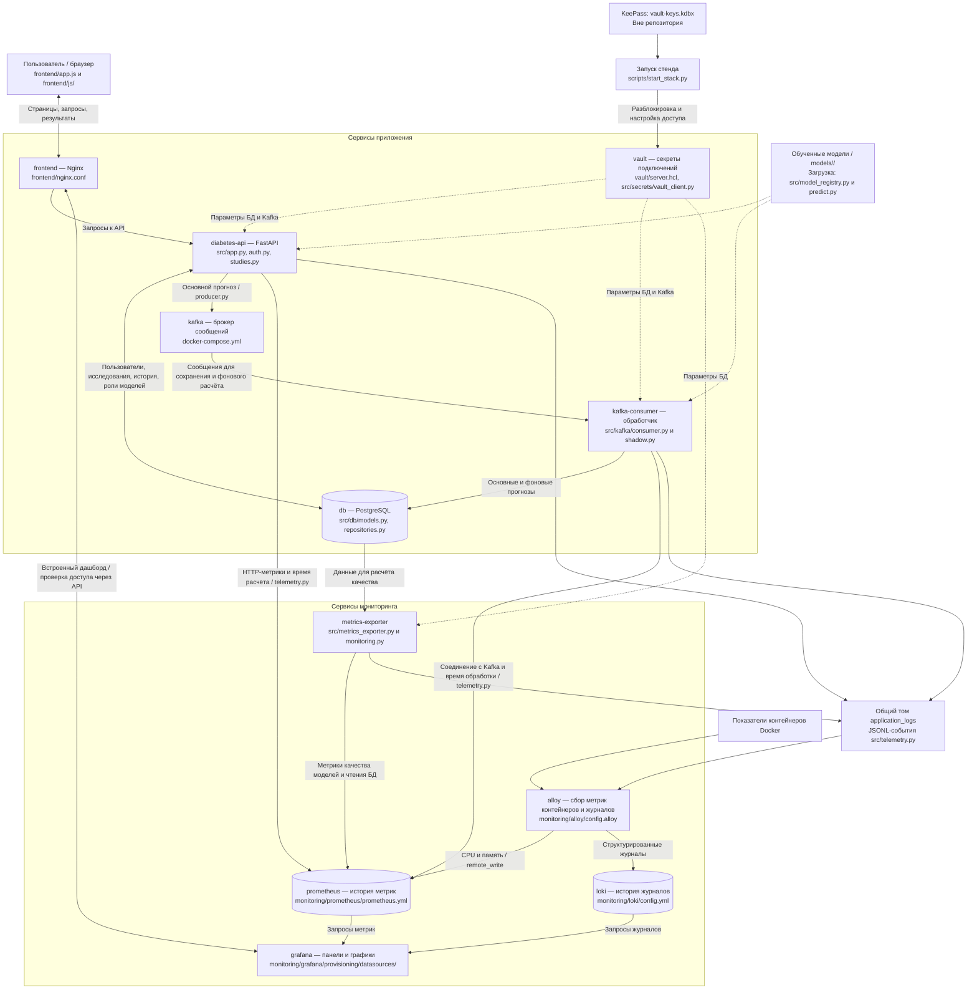
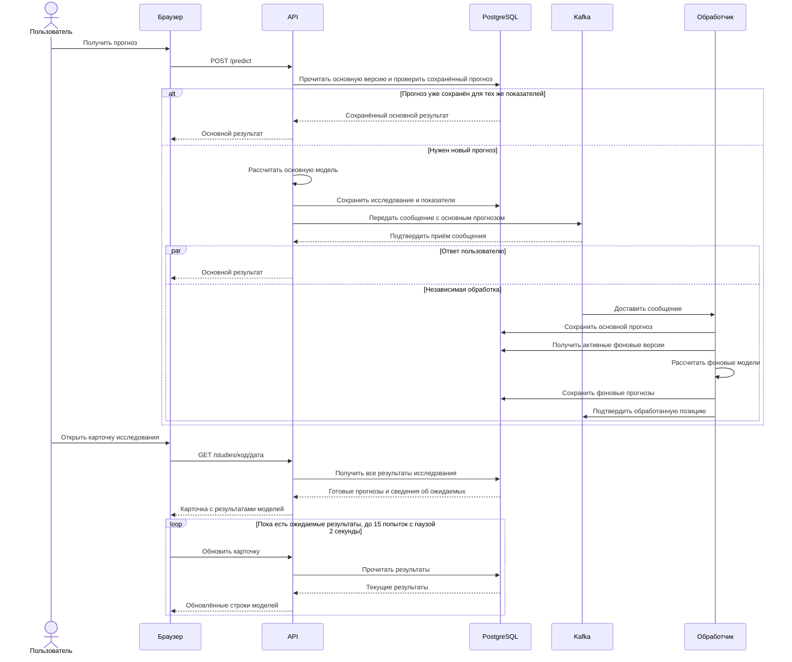
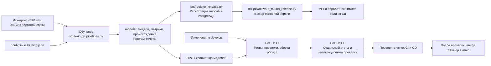

# Архитектура Diabetes Predict

Описание сверено с кодом проекта 9 сентября 2026 года. Назначение файлов перечислено
в [карте проекта](project-map.md). Схемы Mermaid можно просматривать в поддерживающем
их предпросмотре Markdown и на GitHub.

От общего к деталям: [схемы C4 — контекст, контейнеры и компоненты](c4-model.md).

## Общая схема и связь с файлами

Docker Compose запускает 11 сервисов: 6 обеспечивают приложение, 5 — мониторинг.
Модели — сохранённые файлы Python pipeline, а не отдельные контейнеры.
API и обработчик используют общий код проекта, но работают в разных процессах
и контейнерах и самостоятельно подключаются к БД.

Стрелки мониторинга обозначают направление данных. Prometheus сам опрашивает
эндпоинты API, обработчика, экспортера, Alloy и Loki. Метрики контейнеров Alloy
отправляет в Prometheus через `remote_write`.

## Как появляется новый прогноз

Основная модель называется **champion**, фоновые модели для сравнения — **challenger**.
Названия обозначают роли версий, а не конкретный алгоритм.

1. Браузер отправляет показатели пациента в `POST /predict`.
2. API проверяет входные данные и сессию пользователя, читает из БД основную версию.
3. Если для этих показателей уже сохранён прогноз этой версии, API возвращает его.
4. Иначе API загружает основную модель, рассчитывает результат и сохраняет
   исследование с исходными показателями в БД.
5. API отправляет сообщение с показателями и основным прогнозом в Kafka.
   `producer.py` ждёт подтверждения брокера через `.get(timeout=10)`.
   При ошибке публикации запрос заканчивается HTTP 503, а не успешным ответом.
6. После подтверждения брокера API может вернуть пользователю основной прогноз.
7. Обработчик независимо читает сообщение, сохраняет основной прогноз в БД,
   рассчитывает активные фоновые версии и сохраняет их результаты.
8. После успешной обработки обработчик подтверждает позицию сообщения в Kafka.
9. Карточка исследования запрашивает у API результаты всех моделей из БД.

**Подтверждение Kafka означает приём сообщения брокером, а не завершение фонового
расчёта.** Обработчик может успеть закончить работу даже раньше, чем браузер получит
ответ API. Поэтому пользователь часто сразу видит обе модели при открытии карточки.
Это не означает, что `POST /predict` ждёт их обеих.

В `frontend/app.js` функция `submitPrediction` получает основной прогноз,
`openStudy` загружает карточку, а `refreshCard` обновляет ожидаемые результаты.
При остановленном обработчике основной ответ возможен, если Kafka приняла сообщение;
фоновые результаты и сохранение основного результата обработчиком будут задержаны.

## Почему обработчик имеет доступ к БД

`kafka-consumer` — наш постоянно работающий Python-процесс, а Kafka — отдельный
брокер, который хранит и передаёт сообщения. Брокер не запускает модели.

В `src/kafka/consumer.py` функция `save_message_to_database` напрямую открывает
сессию PostgreSQL и сохраняет основной результат. Затем `predict_challengers`
из `src/kafka/shadow.py` читает версии моделей и записывает фоновые результаты.
Параметры подключения обработчик получает из Vault через общую фабрику сессий.
HTTP-запросы к API для записи этих результатов ему не нужны.

При повторной доставке уже сохранённые результаты пропускаются. Необработанная
ошибка не подтверждает позицию Kafka; после перезапуска сообщение читается снова.

## Отдельный путь: исправление исследования

Утверждение «API запускает только основную модель» верно для **нового прогноза**.
При изменении показателей `src/study_editing.py` работает внутри API и сам
пересчитывает активные основные и фоновые версии, а также версии с уже сохранёнными
прогнозами этого исследования. Kafka для этого пересчёта не используется.

Сначала рассчитываются новые результаты, затем изменения исследования, прогнозы
и запись аудита сохраняются одной транзакцией. Ошибка расчёта отменяет изменение.
Изменение только обратной связи не требует пересчёта.

## Запуск, авторизация и Vault

- `scripts/start_stack.py` поднимает инфраструктуру, разблокирует Vault,
  настраивает доступ сервисов, обновляет БД и запускает остальные контейнеры.
- Файл KeePass хранится вне проекта. Он нужен для административного запуска;
  пользователь веб-приложения не открывает его при каждом прогнозе.
- Vault хранит параметры PostgreSQL и Kafka. API и обработчик входят через
  AppRole; экспортер использует роль API. Это чтение секретов из KV-хранилища,
  а не динамическое создание пользователей PostgreSQL на каждый запрос.
- Данные Vault сохраняются в Docker-томе. После перезапуска Vault может требовать
  разблокировки; этот этап выполняет скрипт запуска.
- Веб-авторизация — отдельный механизм: пользователи и сессии находятся в PostgreSQL.
  `src/auth.py` проверяет доступ, `src/passwords.py` работает с хешами паролей.
- Nginx выдаёт интерфейс и проксирует запросы. Для `/grafana/` он проверяет
  административный доступ через API и передаёт Grafana доверенный идентификатор.

## Откуда берётся мониторинг

| Что видим | Кто измеряет | Где хранится и отображается |
|---|---|---|
| Число запросов, ошибки HTTP, время ответа | API, `src/telemetry.py` | Prometheus → Grafana |
| Соединение обработчика и время обработки | Обработчик, `src/telemetry.py` | Prometheus → Grafana |
| CPU и память контейнеров | cAdvisor внутри Alloy | Prometheus → Grafana |
| Журнал действий и ошибок приложения | События API, обработчика и экспортера в JSONL | Alloy → Loki → Grafana |
| Качество моделей на обратной связи | Экспортер читает PostgreSQL | Prometheus → Grafana |

Текущий сбор журналов относится к структурированным событиям приложения. Это
не автоматический сбор всех строк stdout всех 11 контейнеров.

Экспортер сравнивает модели на общей выборке исследований с обратной связью и
результатами всех активных моделей. Если для показателя недостаточно данных,
он может быть неопределённым. Количество исследований надо показывать рядом с качеством.
Выбор периода в Grafana показывает историю измерений экспортера, а не фильтрует
исследования по дате внутри БД.

## Обучение моделей и доставка изменений

Обучение запускается отдельно; новый прогноз автоматически не переобучает модели.
`models/current.json` указывает последний выпуск, а роль основной версии во время
работы приложения выбирается по БД. Это разные понятия.

Текущий CD проверяет образ соответствующего коммита на отдельном стенде GitHub Actions
и удаляет этот тестовый стенд после проверки. Он не обновляет автоматически
приложение на локальном компьютере. Слияние в `main` тоже не выполняется само.

## Предлагаемые три раздела мониторинга

Сейчас интерфейс подключает «Работа приложения». Для «Метрики модели» подготовлены
расчёты отсутствующих замеров, data drift и target drift за 30 дней, отдельно для
активных версий относительно их train-выборок. Подробности —
в [описании метрик](model-monitoring.md). Новые панели по просьбе пользователя пока
не создаются; разделение на три раздела остаётся планом.

| Раздел | Содержание |
|---|---|
| **Состояние сервисов** | Две группы: приложение — frontend, API, PostgreSQL, Kafka, обработчик, Vault; мониторинг — экспортер, Prometheus, Alloy, Loki, Grafana |
| **Запросы и события** | Текущая «Работа приложения»: запросы, время ответа, ошибки, журналы. CPU и память можно разместить рядом с состоянием сервисов |
| **Качество моделей** | Основная и фоновые версии, размер общей выборки, accuracy, precision, recall, F1, матрица ошибок; отдельно — время расчёта |

Для первого раздела нужны проверки с понятным смыслом: доступен ли сервис,
может ли он выполнить свою функцию, доступны ли данные самой проверки.
`up = 1` говорит только об успешном сборе метрик с конкретного адреса.
Он не доказывает, что весь процесс «прогноз → Kafka → БД → фоновые модели» исправен.

Созданные пользователем панели сейчас хранятся в томе `grafana_data`.
Файлы provisioning настраивают источники данных. Экспорт пользовательского
дашборда «Работа приложения» в них не включён.
