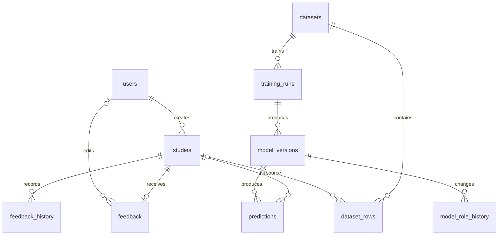

# Схема PostgreSQL

Рабочая схема создана заново по согласованию с пользователем. Старые тестовые
записи не переносятся. Старые миграции доступны в истории Git, но не используются
при инициализации новой БД.



В `studies` восемь отдельных числовых колонок. Уникальны код пациента и дата;
в `predictions` уникальны исследование и версия модели. Признаки в прогнозах
не дублируются. Числа исследований хранятся как NUMERIC без принудительного
округления. Вероятность прогноза сохраняет точность float модели.

Границы: pregnancies 0–20; glucose 0–600; blood_pressure 0–200;
skin_thickness 0–110; insulin 0–1000; bmi 0–100; DPF >0 и ≤3;
age — целое >0 и ≤120. Код пациента: три заглавные латинские буквы и три цифры.
NULL показателей не допускается. Нули пяти измерений обозначают пропуски.

`dataset_rows` хранит неизменяемые признаки и outcome на момент снимка.
Исходный CSV не обязан соответствовать диапазонам API: это самостоятельный
источник обучения. Для его строк source_study_id пуст; для снимков из БД
заполнен. Исправление feedback не меняет ранее сформированный датасет.

`training_runs` сохраняет конфигурацию, разбиение и происхождение выпуска;
`model_versions` — семейство, параметры, метрики и адрес артефакта DVC.
Файлы моделей не хранятся в PostgreSQL. Изменять зарегистрированную версию
нельзя, разрешено только менять роль. Есть не более одной champion.

Триггеры в `db/03_audit.sql` ведут историю меток и ролей в той же транзакции.
Для будущего авторизованного изменения роли приложение задаёт
`SET LOCAL app.actor_id = 'идентификатор пользователя'`; при системной
активации автор остаётся NULL. Аккаунты и данные авторизации пока не создаются.

Структура `db/01_schema.sql` генерируется из ORM командой
`python -m scripts.generate_schema`. `db/02_seed.sql` не содержит привязки к
конкретному выпуску: регистрация всегда выполняется из manifest.

Чистый запуск после получения моделей через DVC:

```powershell
.\.venv\Scripts\python.exe -m scripts.start_stack --keepass-db "путь\к\vault-keys.kdbx"
```

Команда разблокирует постоянный Vault, передаёт контейнерам отдельные AppRole,
регистрирует выпуск и назначает champion только если её ещё нет.
Существующие роли моделей и данные БД сохраняются. Подробнее: [секреты](secrets.md).

`check_database_contract` проверяет ограничения, аудит и неизменяемость снимков
и откатывает свои тестовые записи. `check_prediction_flow` предназначен для
чистого тестового стенда: он оставляет исследование ITG001 без обратной связи.
